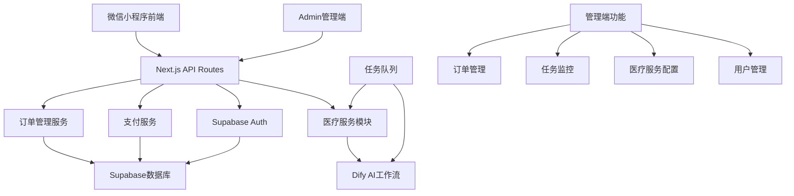

# 设计文档

## 概述

DR.Agent AI 医学服务平台是一个基于微信小程序的医疗健康服务系统，采用前后端分离架构，为医生提供专业AI医疗服务模块。系统包含完整的用户管理、订单处理、支付集成和任务执行引擎，确保医生能够便捷地获得专业的医疗辅助服务。

## 指导文档对齐

### 技术标准 (tech.md)
采用现代化全栈技术架构，支持小程序端和管理端：
- **前端小程序：** 微信小程序原生框架，确保最佳性能和用户体验
- **管理端全栈：** pnpm + Next.js 15 + TypeScript + App Router
- **渲染策略：** Server Components (默认) + Client Components (必要时)
- **数据获取：** TanStack React Query v5 用于客户端状态管理
- **UI组件：** Tailwind CSS + shadcn/ui，提供一致的设计系统
- **数据库：** Drizzle ORM + Supabase，类型安全的数据访问层
- **认证：** Supabase Auth，支持多种认证方式
- **支付：** 微信支付 API 集成
- **AI服务：** Dify工作流集成，提供医疗AI服务能力

### 项目结构 (structure.md)
采用 Next.js 15 全栈架构，同时支持小程序和管理端：
```
# 微信小程序端
miniprogram/
├── pages/          # 页面文件
├── components/     # 自定义组件
├── utils/          # 工具函数
├── services/       # API服务层
└── styles/         # 样式文件

# Next.js 全栈管理端 (App Router)
admin-web/
├── src/
│   ├── app/                    # App Router页面和API路由
│   │   ├── (dashboard)/        # 路由组
│   │   │   ├── orders/         # 订单管理页面
│   │   │   ├── tasks/          # 任务监控页面
│   │   │   ├── services/       # 服务配置页面
│   │   │   └── users/          # 用户管理页面
│   │   ├── api/                # API路由
│   │   │   ├── orders/         # 订单API
│   │   │   ├── tasks/          # 任务API
│   │   │   └── dify/           # Dify集成API
│   │   ├── globals.css         # 全局样式
│   │   ├── layout.tsx          # 根布局 (Server Component)
│   │   └── page.tsx            # 首页 (Server Component)
│   ├── components/             # React组件
│   │   ├── ui/                 # shadcn/ui组件
│   │   ├── server/             # Server Components
│   │   └── client/             # Client Components
│   ├── lib/                    # 工具函数和配置
│   │   ├── react-query.ts      # TanStack Query配置
│   │   ├── supabase.ts         # Supabase客户端
│   │   └── utils.ts            # 通用工具函数
│   ├── db/                     # Drizzle数据库
│   │   ├── schema/             # 数据库模型
│   │   ├── migrations/         # 数据库迁移
│   │   └── index.ts            # 数据库连接
│   ├── hooks/                  # React Query hooks
│   └── types/                  # TypeScript类型定义
├── public/                     # 静态资源
└── tailwind.config.js          # Tailwind配置
```

## 代码复用分析

### 新项目组件规划
- **通用UI组件**：按钮、表单、加载状态、模态框
- **服务层工具**：HTTP请求封装、错误处理、数据验证
- **用户管理组件**：登录表单、注册表单、个人信息编辑

### 集成点
- **微信API集成**：用户授权、支付接口、文件上传
- **Supabase集成**：用户数据、订单数据、服务结果存储、实时同步
- **Dify AI工作流集成**：医疗服务AI处理引擎
- **shadcn/ui组件集成**：统一的UI设计系统

## 架构

系统采用全栈架构设计，同时支持小程序端和管理端：



## 组件和接口

### 前端组件

#### WeChatAuth 组件
- **目的：** 处理微信登录授权和用户信息获取
- **接口：** 
  - `wxLogin(): Promise<LoginResult>`
  - `getUserProfile(): Promise<UserProfile>`
  - `checkAuthStatus(): Promise<boolean>`
- **微信API集成：**
  ```javascript
  // 微信登录
  wx.login({
    success: (res) => {
      // 发送 res.code 到后端换取 openId 和 sessionKey
      this.exchangeCodeForSession(res.code)
    }
  })
  
  // 获取用户信息
  wx.getUserProfile({
    desc: '用于完善用户资料',
    success: (res) => {
      // res.userInfo 包含昵称、头像等信息
      this.updateUserProfile(res.userInfo)
    }
  })
  ```
- **依赖：** 微信小程序登录API、用户信息API
- **复用：** 新建微信授权组件

#### ServiceSelector 组件
- **目的：** 显示AI服务选项
- **接口：** 
  - `onServiceSelect(serviceType: string)`
  - `getAvailableServices(): Promise<Service[]>`
- **依赖：** 微信小程序 navigator API
- **复用：** 新建通用列表组件

#### ServiceForm 组件
- **目的：** 动态生成不同服务的输入表单
- **接口：** 
  - `renderForm(serviceType: string, schema: FormSchema)`
  - `validateForm(): boolean`
  - `onSubmit(formData: any)`
- **依赖：** 文件上传组件、表单验证工具
- **复用：** 新建动态表单生成器

#### OrderManagement 组件
- **目的：** 处理订单创建和支付流程
- **接口：**
  - `createOrder(serviceData: any): Promise<Order>`
  - `initiatePayment(orderId: string)`
  - `checkPaymentStatus(orderId: string): Promise<PaymentStatus>`
- **依赖：** 微信支付API
- **复用：** 新建支付集成组件

#### ConsentForm 组件
- **目的：** 处理知情同意书展示、确认和记录
- **接口：**
  - `displayConsent(version: string)`
  - `recordConsent(userId: string, ipAddress: string): Promise<boolean>`
  - `checkConsentStatus(userId: string): Promise<ConsentStatus>`
- **依赖：** 用户服务、IP获取工具
- **复用：** 新建同意书管理组件

#### EmailVerification 组件
- **目的：** 处理邮箱验证流程
- **接口：**
  - `sendVerificationEmail(email: string): Promise<boolean>`
  - `verifyEmailCode(email: string, code: string): Promise<boolean>`
- **依赖：** 邮件服务、验证码生成
- **复用：** 新建邮件验证组件

#### UserProfile 组件
- **目的：** 管理用户个人信息和设置
- **接口：**
  - `updateProfile(userData: UserData): Promise<boolean>`
  - `validateEmail(email: string): boolean`
  - `submitFeedback(feedback: string): Promise<string>`
- **依赖：** 表单验证、邮件验证
- **复用：** 新建用户管理组件

### 管理端组件架构 (App Router + TanStack Query)

#### 页面层 (Server Components)

##### DashboardPage (Server Component)
- **文件：** `src/app/(dashboard)/page.tsx`
- **目的：** 管理端首页，服务端渲染初始数据
- **数据获取：** 直接查询数据库获取统计数据
- **组件结构：**
  ```tsx
  // 服务端获取初始数据
  const stats = await getOverviewStats()
  const recentOrders = await getRecentOrders()
  
  return (
    <div>
      <StatsCards initialData={stats} />
      <RecentOrdersTable initialData={recentOrders} />
      <SystemHealthMonitor />
    </div>
  )
  ```

##### OrdersPage (Server Component)
- **文件：** `src/app/(dashboard)/orders/page.tsx`
- **目的：** 订单管理页面，服务端渲染订单列表
- **数据获取：** 服务端查询订单数据，支持搜索参数
- **组件结构：**
  ```tsx
  const orders = await getOrders({ page, filters })
  
  return <OrderManagementClient initialData={orders} />
  ```

##### TasksPage (Server Component)
- **文件：** `src/app/(dashboard)/tasks/page.tsx`
- **目的：** 任务监控页面，服务端渲染任务状态
- **数据获取：** 服务端查询任务数据

#### 客户端组件层 (Client Components + TanStack Query)

##### OrderManagementClient (Client Component)
- **文件：** `src/components/client/order-management.tsx`
- **目的：** 订单管理交互功能，使用React Query进行数据同步
- **React Query集成：**
  ```tsx
  'use client'
  
  export function OrderManagementClient({ initialData }: Props) {
    const { data: orders, isLoading } = useQuery({
      queryKey: ['orders', filters],
      queryFn: () => fetchOrders(filters),
      initialData,
      refetchInterval: 30000 // 30秒自动刷新
    })
    
    const updateOrderMutation = useMutation({
      mutationFn: updateOrderStatus,
      onSuccess: () => {
        queryClient.invalidateQueries({ queryKey: ['orders'] })
      }
    })
    
    return <OrderTable orders={orders} onUpdateStatus={updateOrderMutation.mutate} />
  }
  ```
- **依赖：** TanStack Query v5、shadcn/ui Table组件

##### TaskMonitorClient (Client Component)
- **文件：** `src/components/client/task-monitor.tsx`
- **目的：** 实时任务监控，WebSocket + React Query结合
- **实时数据：**
  ```tsx
  'use client'
  
  export function TaskMonitorClient({ initialData }: Props) {
    const { data: tasks } = useQuery({
      queryKey: ['tasks'],
      queryFn: fetchTasks,
      initialData,
      refetchInterval: 5000 // 5秒刷新
    })
    
    // Supabase实时订阅
    useEffect(() => {
      const subscription = supabase
        .channel('tasks')
        .on('postgres_changes', { event: '*', schema: 'public', table: 'tasks' }, 
          (payload) => {
            queryClient.invalidateQueries({ queryKey: ['tasks'] })
          })
        .subscribe()
      
      return () => subscription.unsubscribe()
    }, [])
    
    return <TaskProgressTable tasks={tasks} />
  }
  ```

##### ServiceConfigClient (Client Component)
- **文件：** `src/components/client/service-config.tsx`
- **目的：** 服务配置管理，表单交互和验证
- **表单处理：**
  ```tsx
  'use client'
  
  export function ServiceConfigClient({ initialData }: Props) {
    const { data: configs } = useQuery({
      queryKey: ['service-configs'],
      queryFn: fetchServiceConfigs,
      initialData
    })
    
    const updateConfigMutation = useMutation({
      mutationFn: updateServiceConfig,
      onSuccess: () => {
        queryClient.invalidateQueries({ queryKey: ['service-configs'] })
        toast.success('配置已更新')
      }
    })
    
    return <ConfigForm configs={configs} onSubmit={updateConfigMutation.mutate} />
  }
  ```

#### React Query Hooks层

##### useOrders Hook
- **文件：** `src/hooks/use-orders.ts`
- **目的：** 封装订单相关的数据获取逻辑
```tsx
export function useOrders(filters?: OrderFilters) {
  return useQuery({
    queryKey: ['orders', filters],
    queryFn: () => fetchOrders(filters),
    staleTime: 5 * 60 * 1000, // 5分钟缓存
  })
}

export function useUpdateOrder() {
  const queryClient = useQueryClient()
  
  return useMutation({
    mutationFn: updateOrderStatus,
    onSuccess: () => {
      queryClient.invalidateQueries({ queryKey: ['orders'] })
    }
  })
}
```

##### useTasks Hook
- **文件：** `src/hooks/use-tasks.ts`
- **目的：** 封装任务相关的数据获取和操作
```tsx
export function useTasks() {
  return useQuery({
    queryKey: ['tasks'],
    queryFn: fetchTasks,
    refetchInterval: 5000,
  })
}

export function useRetryTask() {
  const queryClient = useQueryClient()
  
  return useMutation({
    mutationFn: retryTask,
    onSuccess: () => {
      queryClient.invalidateQueries({ queryKey: ['tasks'] })
    }
  })
}
```

#### API层 (Server Actions + API Routes)

##### Server Actions
- **文件：** `src/lib/actions/orders.ts`
- **目的：** 服务端操作，用于表单提交和数据修改
```tsx
'use server'

export async function updateOrderStatusAction(orderId: string, status: string) {
  const result = await db
    .update(orders)
    .set({ status, updatedAt: new Date() })
    .where(eq(orders.id, orderId))
  
  revalidatePath('/dashboard/orders')
  return result
}
```

##### API Routes
- **文件：** `src/app/api/orders/route.ts`
- **目的：** RESTful API端点，用于客户端数据获取
```tsx
export async function GET(request: Request) {
  const { searchParams } = new URL(request.url)
  const page = searchParams.get('page') || '1'
  
  const orders = await fetchOrdersFromDB({ page: parseInt(page) })
  
  return Response.json(orders)
}
```

##### 微信认证API路由
- **文件：** `src/app/api/auth/wechat/route.ts`
- **目的：** 处理微信小程序登录授权
```tsx
// POST /api/auth/wechat
export async function POST(request: Request) {
  try {
    const { code, userInfo } = await request.json()
    
    // 1. 用code换取session
    const sessionData = await weChatAuthService.exchangeCodeForSession(code)
    
    if (!sessionData.openid) {
      return Response.json({ error: '微信授权失败' }, { status: 400 })
    }
    
    // 2. 创建或更新用户
    const user = await weChatAuthService.createOrUpdateUser(sessionData, userInfo)
    
    // 3. 生成JWT token
    const token = await weChatAuthService.generateJWTToken(user.id)
    
    return Response.json({
      token,
      user: {
        id: user.id,
        nickname: user.nickname,
        avatarUrl: user.avatarUrl,
        openId: user.openId
      }
    })
  } catch (error) {
    return Response.json({ error: '登录失败' }, { status: 500 })
  }
}
```

- **文件：** `src/app/api/auth/verify/route.ts`
- **目的：** 验证JWT token有效性
```tsx
// POST /api/auth/verify
export async function POST(request: Request) {
  try {
    const { token } = await request.json()
    
    const user = await weChatAuthService.validateWeChatToken(token)
    
    if (!user) {
      return Response.json({ error: 'Token无效' }, { status: 401 })
    }
    
    return Response.json({ user })
  } catch (error) {
    return Response.json({ error: '验证失败' }, { status: 500 })
  }
}
```

### 后端服务

#### WeChatAuthService
- **目的：** 处理微信登录和用户信息同步
- **接口：**
  - `exchangeCodeForSession(code: string): Promise<WeChatSession>`
  - `createOrUpdateUser(sessionData: WeChatSession, userInfo: WeChatUserInfo): Promise<User>`
  - `generateJWTToken(userId: string): Promise<string>`
  - `validateWeChatToken(token: string): Promise<User>`
- **微信API集成：**
  ```typescript
  // 微信code换取session
  async exchangeCodeForSession(code: string) {
    const response = await fetch(`https://api.weixin.qq.com/sns/jscode2session`, {
      method: 'GET',
      params: {
        appid: process.env.WECHAT_APPID,
        secret: process.env.WECHAT_SECRET,
        js_code: code,
        grant_type: 'authorization_code'
      }
    })
    
    return response.json() // { openid, session_key, unionid }
  }
  
  // 创建或更新用户
  async createOrUpdateUser(sessionData, userInfo) {
    const existingUser = await db.query.users.findFirst({
      where: eq(users.openId, sessionData.openid)
    })
    
    if (existingUser) {
      // 更新用户信息
      return await db.update(users)
        .set({
          nickname: userInfo.nickName,
          avatarUrl: userInfo.avatarUrl,
          gender: userInfo.gender,
          city: userInfo.city,
          province: userInfo.province,
          country: userInfo.country,
          updatedAt: new Date()
        })
        .where(eq(users.id, existingUser.id))
    } else {
      // 创建新用户
      return await db.insert(users).values({
        openId: sessionData.openid,
        unionId: sessionData.unionid,
        nickname: userInfo.nickName,
        avatarUrl: userInfo.avatarUrl,
        gender: userInfo.gender,
        city: userInfo.city,
        province: userInfo.province,
        country: userInfo.country
      })
    }
  }
  ```
- **依赖：** 微信开放平台API、JWT库、Drizzle ORM
- **复用：** 新建微信认证服务

#### AuthService
- **目的：** 处理通用认证和授权（管理端）
- **接口：**
  - `adminLogin(credentials: LoginData): Promise<AuthToken>`
  - `validateToken(token: string): Promise<User>`
  - `refreshToken(refreshToken: string): Promise<AuthToken>`
- **依赖：** Supabase Auth、JWT库
- **复用：** 新建认证服务

#### EmailService
- **目的：** 管理邮件发送和验证功能
- **接口：**
  - `sendVerificationEmail(email: string, code: string): Promise<boolean>`
  - `sendNotification(email: string, message: string)`
- **依赖：** SMTP服务、邮件模板
- **复用：** 新建邮件服务

#### SecurityService
- **目的：** 处理密码加密、会话管理和安全验证
- **接口：**
  - `hashPassword(password: string): Promise<string>`
  - `validateSession(token: string): Promise<boolean>`
  - `scanFileForVirus(file: Buffer): Promise<boolean>`
- **依赖：** bcrypt库、病毒扫描API
- **复用：** 新建安全服务

#### DifyService
- **目的：** 集成Dify AI工作流，处理医疗服务AI任务
- **接口：**
  - `executeWorkflow(workflowId: string, inputs: any): Promise<WorkflowResult>`
  - `getWorkflowStatus(executionId: string): Promise<WorkflowStatus>`
  - `getAvailableWorkflows(): Promise<Workflow[]>`
  - `validateWorkflowInputs(workflowId: string, inputs: any): boolean`
- **依赖：** Dify API客户端、任务队列
- **复用：** 新建Dify集成服务

#### MedicalService
- **目的：** 管理AI医疗服务的业务逻辑，协调Dify工作流
- **接口：**
  - `processDifyService(data: any): Promise<Result>`
- **依赖：** DifyService、文件处理、任务队列
- **复用：** 新建AI医疗服务处理器

#### TaskQueueService
- **目的：** 管理异步任务队列，处理长时间运行的AI工作流
- **接口：**
  - `enqueueTask(taskData: TaskData): Promise<string>`
  - `getTaskStatus(taskId: string): Promise<TaskStatus>`
  - `retryTask(taskId: string): Promise<boolean>`
  - `cancelTask(taskId: string): Promise<boolean>`
- **依赖：** Redis/Supabase队列、Dify服务
- **复用：** 新建任务队列服务

#### OrderService
- **目的：** 管理订单生命周期
- **接口：**
  - `createOrder(serviceType: string, data: any): Promise<Order>`
  - `updateOrderStatus(orderId: string, status: string)`
  - `getOrderHistory(userId: string): Promise<Order[]>`
- **依赖：** 数据库连接、支付服务
- **复用：** 新建订单管理系统

## 数据模型 (Drizzle ORM + Supabase)

### User 模型
```typescript
// src/db/schema/users.ts
import { pgTable, uuid, varchar, timestamp, boolean, integer } from 'drizzle-orm/pg-core'

export const users = pgTable('users', {
  id: uuid('id').primaryKey().defaultRandom(),
  // 微信相关字段
  openId: varchar('open_id', { length: 128 }).notNull().unique(),
  unionId: varchar('union_id', { length: 128 }), // 微信开放平台统一ID
  nickname: varchar('nickname', { length: 100 }), // 微信昵称
  avatarUrl: varchar('avatar_url', { length: 500 }), // 微信头像URL
  gender: integer('gender'), // 性别：0-未知，1-男，2-女
  city: varchar('city', { length: 50 }), // 城市
  province: varchar('province', { length: 50 }), // 省份
  country: varchar('country', { length: 50 }), // 国家
  language: varchar('language', { length: 10 }), // 语言
  
  // 业务相关字段
  email: varchar('email', { length: 255 }),
  profession: varchar('profession', { length: 100 }),
  phone: varchar('phone', { length: 20 }),
  
  // 系统字段
  registeredAt: timestamp('registered_at').notNull().defaultNow(),
  consentAgreedAt: timestamp('consent_agreed_at'),
  consentVersion: varchar('consent_version', { length: 50 }),
  isActive: boolean('is_active').default(true),
  lastLoginAt: timestamp('last_login_at'),
  createdAt: timestamp('created_at').notNull().defaultNow(),
  updatedAt: timestamp('updated_at').notNull().defaultNow()
})

export type User = typeof users.$inferSelect
export type NewUser = typeof users.$inferInsert

// 微信用户信息类型定义
export interface WeChatUserInfo {
  nickName: string
  avatarUrl: string
  gender: number
  city: string
  province: string
  country: string
  language: string
}

export interface WeChatSession {
  openid: string
  session_key: string
  unionid?: string
}
```

### Order 模型
```typescript
// src/db/schema/orders.ts
import { pgTable, uuid, varchar, jsonb, decimal, timestamp } from 'drizzle-orm/pg-core'
import { users } from './users'

export const orders = pgTable('orders', {
  id: uuid('id').primaryKey().defaultRandom(),
  userId: uuid('user_id').notNull().references(() => users.id),
  serviceType: varchar('service_type', { length: 50 }).notNull(),
  serviceData: jsonb('service_data').notNull(),
  status: varchar('status', { length: 20 }).notNull().default('pending'),
  amount: decimal('amount', { precision: 10, scale: 2 }).notNull(),
  paymentMethod: varchar('payment_method', { length: 50 }),
  transactionId: varchar('transaction_id', { length: 100 }),
  difyExecutionId: varchar('dify_execution_id', { length: 100 }),
  result: jsonb('result'),
  createdAt: timestamp('created_at').notNull().defaultNow(),
  paidAt: timestamp('paid_at'),
  completedAt: timestamp('completed_at'),
  updatedAt: timestamp('updated_at').notNull().defaultNow()
})

export type Order = typeof orders.$inferSelect
export type NewOrder = typeof orders.$inferInsert
```

### Task 模型 (新增)
```typescript
// src/db/schema/tasks.ts
import { pgTable, uuid, varchar, jsonb, integer, timestamp } from 'drizzle-orm/pg-core'
import { orders } from './orders'

export const tasks = pgTable('tasks', {
  id: uuid('id').primaryKey().defaultRandom(),
  orderId: uuid('order_id').notNull().references(() => orders.id),
  difyWorkflowId: varchar('dify_workflow_id', { length: 100 }).notNull(),
  difyExecutionId: varchar('dify_execution_id', { length: 100 }),
  status: varchar('status', { length: 20 }).notNull().default('pending'),
  inputData: jsonb('input_data').notNull(),
  outputData: jsonb('output_data'),
  errorMessage: varchar('error_message', { length: 1000 }),
  executionTime: integer('execution_time'), // 执行时长（秒）
  retryCount: integer('retry_count').default(0),
  createdAt: timestamp('created_at').notNull().defaultNow(),
  startedAt: timestamp('started_at'),
  completedAt: timestamp('completed_at'),
  updatedAt: timestamp('updated_at').notNull().defaultNow()
})

export type Task = typeof tasks.$inferSelect
export type NewTask = typeof tasks.$inferInsert
```

### Feedback 模型
```typescript
// src/db/schema/feedback.ts
import { pgTable, uuid, varchar, text, timestamp } from 'drizzle-orm/pg-core'
import { users } from './users'

export const feedback = pgTable('feedback', {
  id: uuid('id').primaryKey().defaultRandom(),
  userId: uuid('user_id').notNull().references(() => users.id),
  content: text('content').notNull(),
  feedbackNumber: varchar('feedback_number', { length: 20 }).notNull().unique(),
  category: varchar('category', { length: 50 }),
  status: varchar('status', { length: 20 }).notNull().default('pending'),
  adminResponse: text('admin_response'),
  createdAt: timestamp('created_at').notNull().defaultNow(),
  updatedAt: timestamp('updated_at').notNull().defaultNow()
})

export type Feedback = typeof feedback.$inferSelect
export type NewFeedback = typeof feedback.$inferInsert
```

### ServiceConfig 模型 (新增)
```typescript
// src/db/schema/service_configs.ts
import { pgTable, uuid, varchar, jsonb, boolean, timestamp, text } from 'drizzle-orm/pg-core'

export const serviceConfigs = pgTable('service_configs', {
  id: uuid('id').primaryKey().defaultRandom(),
  serviceType: varchar('service_type', { length: 50 }).notNull().unique(),
  difyWorkflowId: varchar('dify_workflow_id', { length: 100 }).notNull(),
  displayName: varchar('display_name', { length: 100 }).notNull(),
  description: text('description'),
  inputSchema: jsonb('input_schema').notNull(),
  pricing: jsonb('pricing').notNull(),
  isActive: boolean('is_active').default(true),
  createdAt: timestamp('created_at').notNull().defaultNow(),
  updatedAt: timestamp('updated_at').notNull().defaultNow()
})

export type ServiceConfig = typeof serviceConfigs.$inferSelect
export type NewServiceConfig = typeof serviceConfigs.$inferInsert
```

## 错误处理

### 错误场景
1. **用户认证失败**
   - **处理：** 返回401状态码，清除本地token
   - **用户影响：** 跳转到登录页面

2. **支付处理失败**
   - **处理：** 记录支付日志，回滚订单状态
   - **用户影响：** 显示支付失败信息，提供重试选项

3. **文件上传失败**
   - **处理：** 验证文件大小和格式，返回具体错误信息
   - **用户影响：** 显示上传错误提示，指导用户重新上传

4. **医疗服务执行失败**
   - **处理：** 记录执行日志，标记订单为失败状态
   - **用户影响：** 通知执行失败，提供退款或重新执行选项

## 测试策略

### 单元测试
- 后端服务类的业务逻辑测试
- 数据模型验证和转换测试
- 工具函数的输入输出测试

### 集成测试
- API端点的完整请求-响应测试
- 数据库操作的CRUD测试
- 微信支付API集成测试

### 端到端测试
- 完整用户注册和登录流程
- 医疗服务从选择到结果查看的完整流程
- 订单创建、支付、执行的完整业务流程